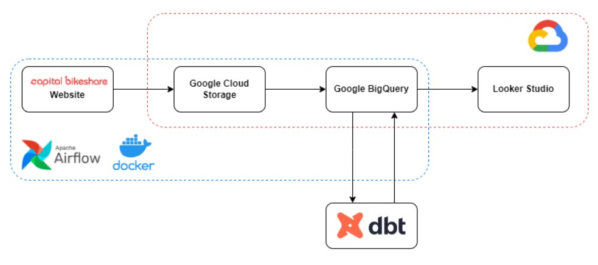
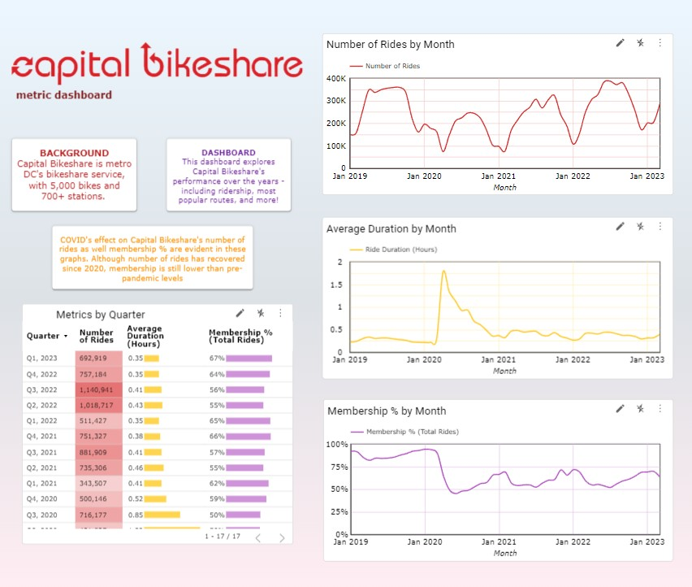
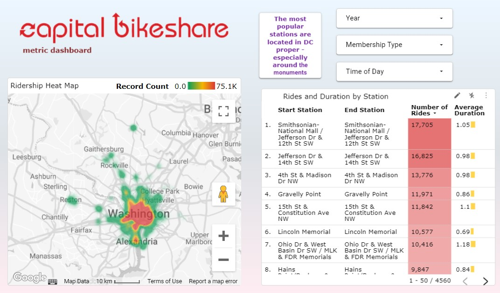

# DC Bike Trip Project

## Overview

The goal of this project is to build a data pipeline to automatically download, posture, and present data collected by Capital Bikeshare, a bikesharing company local to the Washington, DC area. Airflow is used to build the data pipelines that download the Capital Bikeshare data off the web and upload the datasets to GCS and Google BigQuery. Within BigQuery, the data is then cleaned, engineered, and tested with DBT, which produces the final datasets that are used for the visualizations. The final deliverable of this project is an interactive dashboard created within Looker Studio, where several metrics (such as ridership, membership percentage, and ride duraction) can be easily explored.

## Dataset

The Capital Bikeshare website [uploads data quarterly](https://s3.amazonaws.com/capitalbikeshare-data/index.html). From April 2021 onwards, the uploaded datasets changed slightly in format, requiring separate airflow DAGs to handle the data differently depending on upload date. This change affected the names of several columns but also added more variables (such as latitude and longitude) to each ride. Latitude and longitude were added to the pre-April 2021 datasets with DBT later on in the project. Other columns were renamed within DBT so that a final, master dataset could be created. 

## Technologies and Architecture

This project uses the following technologies for its implementation:

1. Docker: Builds airflow images
2. Airflow: Workflow orchestration within a python environment
3. Google Cloud Platform (GCP):
    - Google Cloud Storage (GCS): stores raw data within a data lake
    - Google Bigquery: organizes data within a data warehouse
    - Looker Studio: creates visualizations within a dashboard
4. DBT Cloud: cleans, transforms, and combines data to prepare for visualization
5. SQL: Used at various points within BigQuery and DBT
6. Terraform: IaC used to create infrastructure within GCP.

The end-to-end process follows this sequence:



## Dashboard

The final product is a dashboard, which explores various metrics (such as rider count, membership %, and ride duration) over time. The dashboard also provides geo data, which explores how ridership is concentrated across the DC metro, and how this ridership has shifted over time. 

The dashboard can be accessed [here](https://lookerstudio.google.com/reporting/6a255a13-aef9-4e6a-824d-4020e220c9e0).





## How to replicate

1. Create Google Cloud environment. After setting up an account, grant your service account permissions for BigQuery Admin, Storage Admin and Storage Object Admin. Afterwards, download the JSON file and export it your Google SDK credentials. 

2. Set up infrastructure using terraform. First install the terraform files and then use these bash commands to set up the proper 


infrastructure:

```bash
# Refresh service-account's auth-token for this session
gcloud auth application-default login
terraform init
terraform plan -var="project=<your-gcp-project-id>"
```

3. Set up Airflow by downloading the files from this repository and initializing the docker-compose file. You can simply modify the global variables within each DAG to specify which months you would like to download data for. At this point, you should have tables in BigQuery which are ready to be transformed and combined in DBT. 

4. Download and run the DBT models and tests. 

5. Create a LookerStudio dashboard and connect to the proper data source in BigQuery that was created within DBT. 
